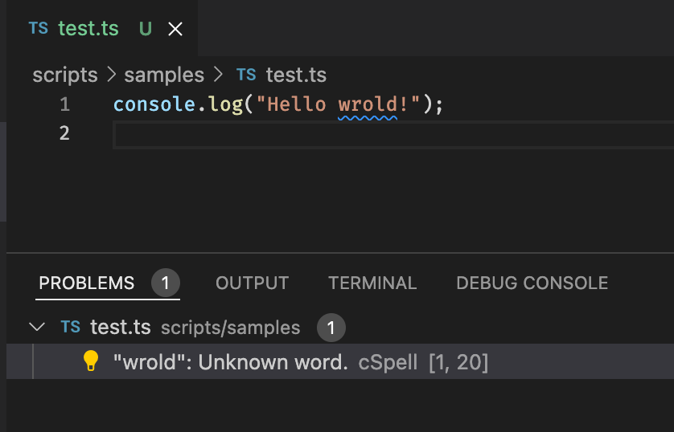
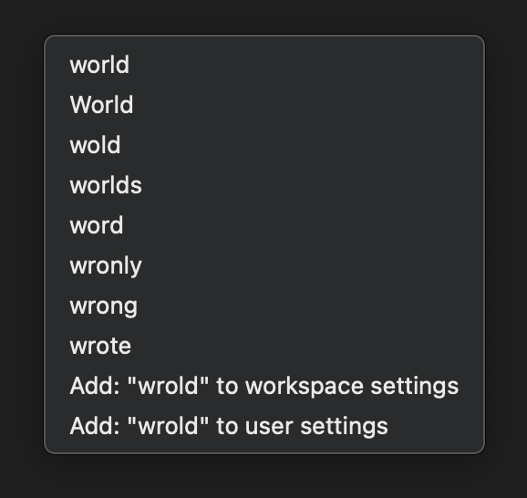
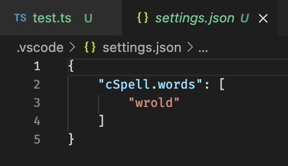

!> 이 글은 오래된 글을 복사한 글입니다.

vscode 확장 Code Spell Checker 확장에 대해 간단하게 알아보겠습니다.

## 목차 \{#TOC\}

[TOC]

## 세 줄 요약 \{#tl-dr\}

- 코드에서 자동으로 영어 스펠링 검사, 이상한 부분 강조 표시
- 단어를 직접 사전에 추가할 수 있음, workspace settings에 추가하는 걸 권장
- 큰 파일을 열었을 때는 많이 느려질 수도 있어요!

## 기능 \{#features\}

코드에서 스펠링이 틀린 부분을 찾아서 강조해줍니다.

오타를 쉽게 발견할 수 있습니다.

저 문제의 Quick Fix에서 비슷한 단어를 보고, 바로 그 단어로 수정할 수 있습니다.

그런데 오타가 아니라면? 예를 들어 프로젝트 이름이 wrold일 수도 있겠죠?

그런 경우에는 그 단어를 사전에 직접 추가할 수 있습니다.

Quick Fix에서 `Add: "wrold" to workspace settings`를 선택하거나 `Spell: Add Words to Sorkspace Settings` 커맨드를 통해 추가해 주세요.

그러면 workspace 설정에 단어가 추가되고 더 이상 오류로 나타내지 않습니다.

User Settings에 추가하면 VCS에 의해 공유되지 않기 때문에 Workspace Settings에 추가하는 것을 권장합니다.

그 외에도 다양한 기능이 있지만 저도 안 쓰고, 다른 누구도 별로 안 쓸 것 같으니 그냥 넘어갈게요

## 주의사항 \{#caution\}

큰 파일을 열면 많이 느려질 수 있어요.

어느 날부터 vscode가 엄청 느려졌다면 이 확장을 의심해 볼 만도 합니다.
